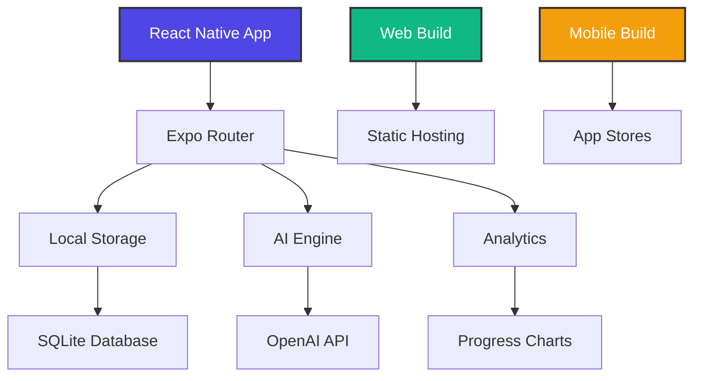

# AccountabilityApp 🎯

> A cross-platform accountability and habit tracking application built with React Native and Expo


## 🚀 Quick Start

```bash
# Clone and setup
git clone https://github.com/lantzmurray/AccountabilityApp.git
cd AccountabilityApp
npm install

# Start development server
npm start

# Run on specific platforms
npm run ios     # iOS simulator
npm run android # Android emulator
npm run web     # Web browser
```

## 📱 What It Does

AccountabilityApp helps users build and maintain positive habits through:
- **Smart Goal Tracking**: Set and monitor daily, weekly, and monthly goals
- **AI-Powered Insights**: Get personalized suggestions and motivation
- **Cross-Platform Sync**: Seamless experience across mobile and web
- **Progress Analytics**: Visual charts and streak tracking
- **Social Accountability**: Share progress with accountability partners

## 🏗️ Architecture



## 🛠️ Tech Stack

| Layer | Technology | Purpose |
|-------|------------|----------|
| **Frontend** | React Native + Expo | Cross-platform mobile/web |
| **Navigation** | Expo Router | File-based routing |
| **Database** | SQLite | Local data persistence |
| **AI** | OpenAI API | Smart insights and suggestions |
| **State** | Zustand | Global state management |
| **Styling** | NativeWind | Tailwind CSS for React Native |
| **Build** | EAS Build | Cloud-based builds |
| **Deployment** | Multiple | GitHub Pages, Netlify, Vercel |

## 📦 Project Structure

```
AccountabilityApp/
├── app/                    # Expo Router pages
│   ├── (tabs)/            # Tab navigation
│   ├── _layout.tsx        # Root layout
│   └── modal.tsx          # Modal screens
├── components/            # Reusable UI components
│   ├── ui.tsx            # Core UI components
│   └── Themed.tsx        # Theme-aware components
├── lib/                   # Core business logic
│   ├── db.ts             # Database operations
│   ├── ai.ts             # AI integration
│   └── store.ts          # State management
├── scripts/               # Build and deployment
│   ├── deploy.js         # Deployment automation
│   └── serve.js          # Local server
├── .github/workflows/     # CI/CD pipelines
└── docs/                  # Documentation
```

## 🚀 Deployment Options

### Web Deployment
```bash
# Build for web
npm run build:web

# Deploy to different platforms
npm run deploy:netlify    # Netlify
npm run deploy:vercel     # Vercel
npm run deploy:firebase   # Firebase Hosting
```

### Mobile Deployment
```bash
# Configure EAS
npx eas build:configure

# Build for app stores
npx eas build --platform all
npx eas submit --platform all
```

### GitHub Pages (Automated)
Push to `master` branch triggers automatic deployment via GitHub Actions.

## 💰 Cost Estimate

| Service | Tier | Monthly Cost |
|---------|------|-------------|
| **Development** | Free | $0 |
| Expo (Hobby) | Free builds | $0 |
| GitHub Pages | Public repo | $0 |
| OpenAI API | Pay-per-use | ~$5-15 |
| **Production** | | |
| EAS Build | Paid tier | $29/month |
| Netlify Pro | Optional | $19/month |
| **Total (Dev)** | | **$5-15/month** |
| **Total (Prod)** | | **$53-63/month** |

## 🧪 Development

### Prerequisites
- Node.js 18+
- npm or yarn
- Expo CLI
- iOS Simulator (Mac) or Android Studio

### Environment Setup
```bash
# Copy environment template
cp .env.example .env.local

# Add your API keys
EXPO_PUBLIC_OPENAI_API_KEY=your_openai_key_here
```

### Available Scripts
```bash
npm start          # Start Expo development server
npm run ios        # Run on iOS simulator
npm run android    # Run on Android emulator
npm run web        # Run in web browser
npm run build:web  # Build for web deployment
npm run serve      # Serve built web app locally
npm run deploy     # Run deployment script
npm test           # Run tests (when implemented)
```

## 🔧 Configuration

### EAS Configuration (`eas.json`)
```json
{
  "build": {
    "preview": {
      "distribution": "internal"
    },
    "production": {
      "distribution": "store"
    }
  }
}
```

### App Configuration (`app.json`)
Key settings for cross-platform deployment and app store submission.

## 🤝 Contributing

1. Fork the repository
2. Create a feature branch: `git checkout -b feat/amazing-feature`
3. Commit changes: `git commit -m 'Add amazing feature'`
4. Push to branch: `git push origin feat/amazing-feature`
5. Open a Pull Request

## 📄 License

MIT License - see [LICENSE](LICENSE) file for details.

## 🔗 Links

- **Repository**: [GitHub](https://github.com/lantzmurray/AccountabilityApp)
- **Live Demo**: [GitHub Pages](https://lantzmurray.github.io/AccountabilityApp)
- **Documentation**: [Wiki](https://github.com/lantzmurray/AccountabilityApp/wiki)
- **Issues**: [Bug Reports](https://github.com/lantzmurray/AccountabilityApp/issues)

## 📞 Support

For questions and support:
- 📧 Email: [your-email@example.com]
- 💬 Discord: [Your Discord Server]
- 🐦 Twitter: [@yourusername]

---

**Built with ❤️ using React Native and Expo**

*Ready to build better habits? Start tracking your accountability today!*